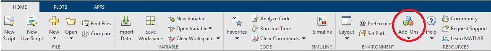

# RTI Connext for Simulink DDS Blockset

[Real-Time Innovations](https://www.rti.com) (RTI) is the largest software
framework provider for Autonomous and Distributed Systems. RTI Connext® is a
suite based on the Data Distribution Service (DDS) standard, that enables
applications to securely share information in real time and work as one
integrated system. RTI Connext provides a comprehensive software library, a set
of development and monitoring tools, and many infrastructure services that
support use cases, such as, data record and replay, connect systems across
wide area networks, bridge to other protocols, and integrate with cloud systems
environments.

The MathWorks [DDS Blockset](https://www.mathworks.com/products/dds.html)
application is fully integrated with RTI Connext for easy development of
Simulink® applications that can be distributed on a network using DDS for
communication. DDS Blockset provides engineers with DDS custom blocks to model
DDS communication between Simulink and pure DDS applications without custom
coding. System designers and application developers can incorporate RTI Connext
into their Simulink designs as virtual components, ready to connect to other
Simulink and non-Simulink components through the DDS databus.

Users can generate code from Simulink models and deploy their models integrated
with RTI Connext DDS.

The `RTI Connext for DDS Blockset` toolbox allows you to install an evaluation
bundle of RTI Connext DDS for use only with the MathWorks [DDS Blockset](https://www.mathworks.com/products/dds.html).

Review the [License Agreement](RTI_License_Agreement.pdf) file for more details.

# About this repository

This repository is **not intended to be cloned or used directly**. Its purpose
is to hold supporting files that facilitate the configuration of RTI Connext
into MATLAB® and Simulink. It does not include RTI Connext DDS itself.

To correctly install the `RTI Connext for DDS Blockset` you have two options:

1. Use the Add-On Explorer from the MATLAB UI.

2. Use the [MathWorks File Exchange](https://www.mathworks.com/matlabcentral/fileexchange/) web portal.

In both cases, the add-on to be installed is shown in the following picture:

# Installation requirements

The `RTI Connext for DDS Blockset` requires the following software:
 * MATLAB 2021a, or later
 * DDS Blockset
